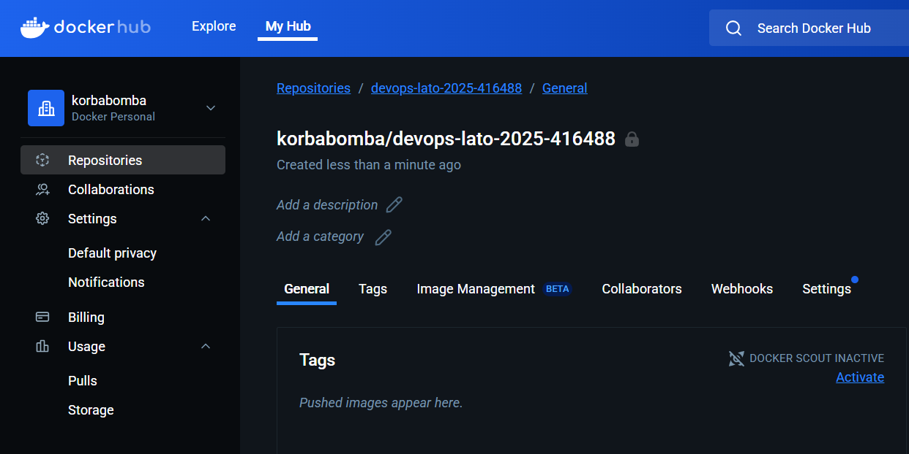
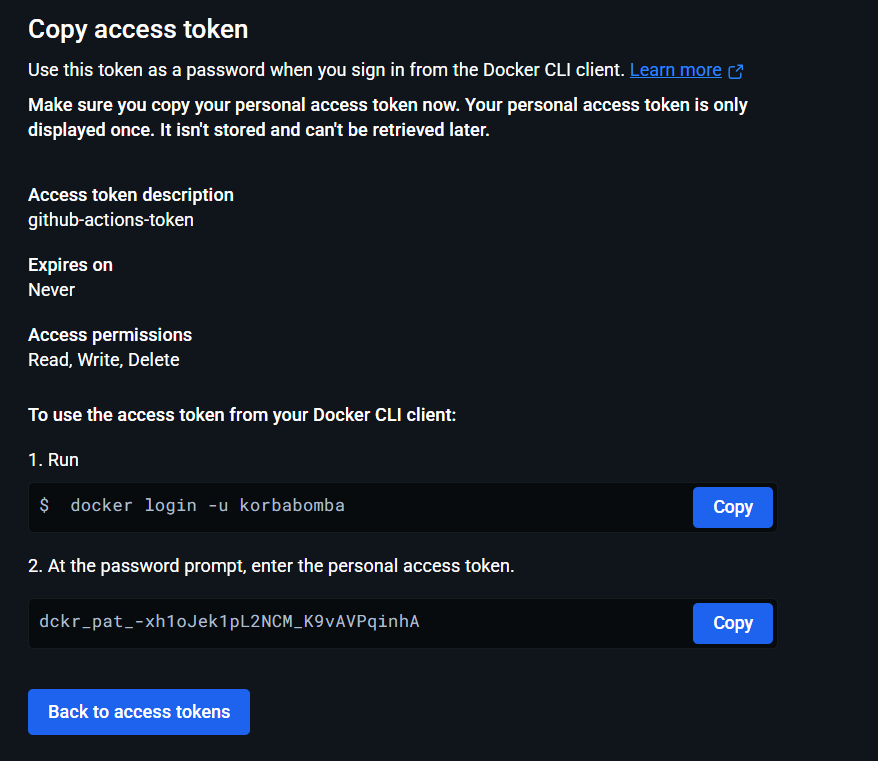
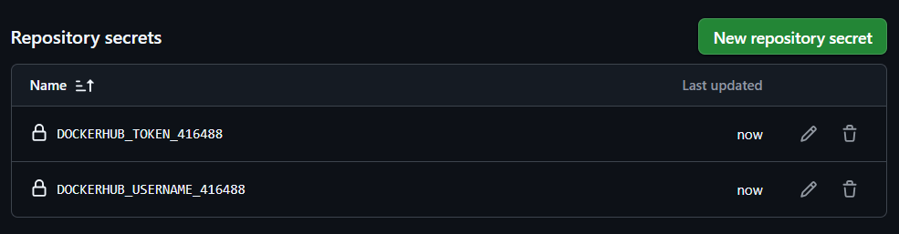
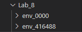
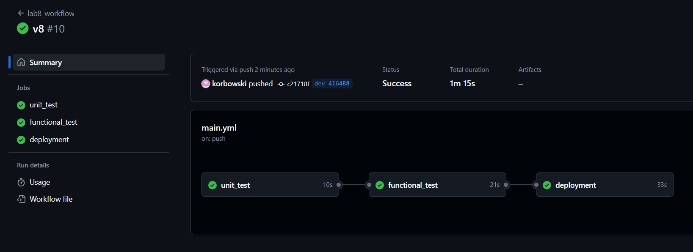
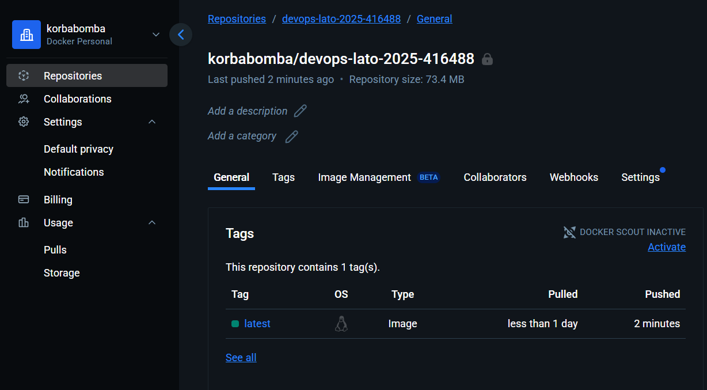
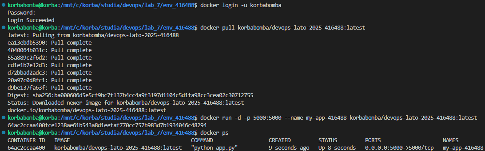
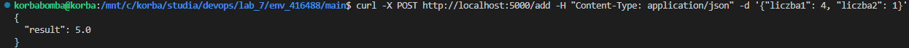

# Sprawozdanie z Laboratorium 8: Git Actions Deployment Pipeline

**Autor:** Imię Nazwisko
**Nr indeksu:** 416488

## Cel ćwiczenia
Celem ćwiczenia była konfiguracja potoku CI/CD w GitHub Actions w celu automatycznego testowania i wdrażania obrazu Docker do prywatnego repozytorium na Docker Hub.

---

### Krok 1: Przygotowanie repozytorium i brancha

Zaktualizowałem repozytorium i stworzyłem dedykowany branch roboczy `Lab8/416488` do pracy nad zadaniem.

---

### Krok 2: Konfiguracja Docker Hub i Sekretów GitHub

Założyłem konto na Docker Hub, utworzyłem prywatne repozytorium na obrazy i wygenerowałem token dostępu.





Następnie skonfigurowałem sekrety `DOCKERHUB_USERNAME` i `DOCKERHUB_ACCESS_TOKEN` w ustawieniach repozytorium GitHub.



---

### Krok 3: Stworzenie folderu roboczego

Skopiowałem bazowy folder `env_00000` do nowego katalogu `env_416488`, który posłużył jako środowisko pracy.



---

### Krok 4: Modyfikacja i uruchomienie pipeline'u CI/CD

Zmodyfikowałem plik `.github/workflows/main.yml`, aby zautomatyzować proces budowania, testowania i wdrażania. W trakcie pracy zidentyfikowałem i naprawiłem błędy w testach funkcjonalnych, które uniemożliwiały poprawne działanie aplikacji.

```yaml
name: lab8_workflow

on:
  push:
    branches:
      - dev-416488

jobs:
  unit_test:
    runs-on: ubuntu-latest
    steps:
    - name: Checkout code
      uses: actions/checkout@v2
    - name: Set up Python
      uses: actions/setup-python@v2
      with:
        python-version: '3.11'
    - name: Install requirements
      run: |
        pip install -r requirements.txt
    - name: Run unit tests
      run: |
        pytest main/calculator_test.py

  functional_test:
    needs: unit_test
    runs-on: ubuntu-latest
    steps:
    - name: Checkout code
      uses: actions/checkout@v2
    - name: Set up Python
      uses: actions/setup-python@v2
      with:
        python-version: '3.11'
    - name: Install requirements
      run: |
        pip install -r requirements.txt
    - name: Run app
      run: |
        python main/app.py &
        sleep 5
    - name: Functional tests
      run: |
        pytest main/app_test.py

  deployment:
    needs: functional_test
    runs-on: ubuntu-latest
    steps:
    - name: Checkout code
      uses: actions/checkout@v2
    - name: Log in to Docker Hub
      uses: docker/login-action@v2
      with:
        username: ${{ secrets.DOCKERHUB_USERNAME_416488 }}
        password: ${{ secrets.DOCKERHUB_TOKEN_416488 }}
    - name: Debug list all
      run: |
        ls -l
    - name: Build and push Docker image
      uses: docker/build-push-action@v4
      with:
        context: .
        file: ./dockerfile
        push: true
        tags: ${{ secrets.DOCKERHUB_USERNAME_416488 }}/devops-lato-2025-416488:latest
```

Po wypchnięciu zmian, potok CI/CD zakończył się sukcesem, wykonując wszystkie joby sekwencyjnie.



Wynikowy obraz Docker został pomyślnie wdrożony do prywatnego repozytorium na Docker Hub.



---

### Krok 5: Lokalny test wdrożonego obrazu

Pobrałem obraz z Docker Hub na mój lokalny komputer i uruchomiłem go jako kontener, aby zweryfikować jego działanie.



Aplikacja uruchomiona w kontenerze działała poprawnie, co potwierdziłem, wykonując test lokalnie.
